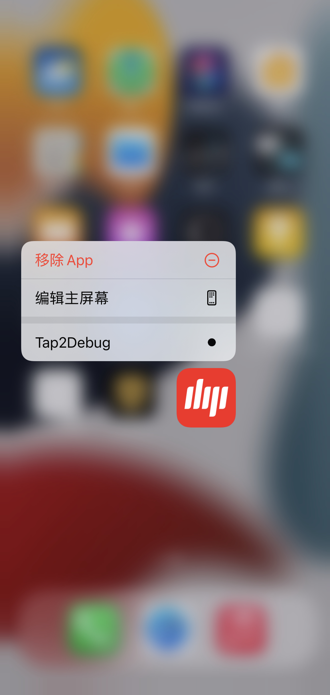

# Tap2DebugRootless
基于 Dopamine 无根越狱实现的插件，该插件可以通过使用 3D Touch 快速 Debug 调试某个 App

#### Screenshots

  

#### Install

##### 准备：

- 安装巨魔 （https://ios.cfw.guide/installing-trollstore/）
- 通过巨魔安装`resource`里的`Dopamine2.0.8`并执行越狱操作

- 通过巨魔安装`resource`里的`Filza`
- 安装`Theos`环境 （参考文章`https://cloud.tencent.com/developer/article/2007333`）

##### 方式一：自主编译

- ```shell
  https://github.com/DargonLee/Tap2DebugRootless.git
  ```

- ```
  cd Tap2DebugRootless
  ```

- ```shell
  make clean && make && make package
  ```

- 拷贝`packages`文件夹下的`deb`文件到`Filza`的某个目录，然后点击安装

- 安装成功后打开`Dopamine`重启用户空间就可以正常使用了

##### 方式二：直接安装

- 下载Release包
- 拷贝`deb`文件到`Filza`的某个目录，然后点击安装
- 安装成功后打开`Dopamine`重启用户空间就可以正常使用了

#### Usage

- 长按要调试的 App 选择`Tap2Debug`

- 点击`Attach`

- 然后点击打开 App

- 在 Mac 设备上打开终端输入`lldb`

- ```shell
  (lldb) process connect connect://192.168.12.76:20221
  ```

- 192.168.12.76 是你手机的 ip 地址

#### Credit

- [4ch12dy/Tap2Debug: tap shortcut(double tap app icon is deault close because app will pause) to debug app (support iOS11/12/13 and A12) (github.com)](https://github.com/4ch12dy/Tap2Debug)
- [SpringBoard tweak 双击图标启动debugserver - 干货分享 - 睿论坛 (iosre.com)](https://iosre.com/t/springboard-tweak-双击图标启动debugserver/16420)
